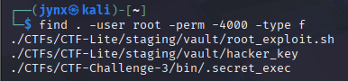

# Command-Line Challenges

**- Sunday, 13 July 2025**

### 1. **List all files recursively** under `/home` that are owned by `root` and have SUID set.

> `$ find . -user root -perm -4000 -type f`
> 

- `find .` - starting in current directory for the search recursively
- `-user root` - files owned by the root user
- `-perm -4000` - files with SUID bit set (4000 in octal)
- `-type f` - only regular files (not directories or special files)

### 2. **Print full path + size of top 5 largest files** inside home directory (recursively)

> `$ find . -type f -exec du -h {} + | sort -rh | head -5`
> 

- `find . -type f` - finds all regular file types recursively from the current directory
- `du -h` - shows disk usage in human-readable format (K, M, G)
- `sort -rh` - sorts in reverse order by human-readable numbers
- `head -5` - shows only the first 5 results
- `ls -lh` - shows file details in human-readable format

### **+ (plus sign)**

- **Meaning**: Command terminator for `exec`
- **Purpose**: More efficient than `;` - groups multiple files into single command calls
- **Difference**: `+` runs `du -h file1 file2 file3` while `;` runs `du -h file1; du -h file2; du -h file3`
- **Security Note -** Both terminators are safe from shell injection because `find` passes arguments directly to the command without shell interpretation

### 3. **Find all hidden `.txt` files** inside your CTF directory.

> `$ find ~/CTFs -name ".*.txt" -type f`
> 

### **`find ~/CTFs`**

- **`find`**: The search command
- **`~/CTFs`**: Starting directory

### **`name ".*.txt"`**

- **`name`**: Filter by filename pattern
- **`".*.txt"`**: Pattern for hidden files ending in `.txt`
- **`.`**: Files starting with dot (hidden files in Unix/Linux)
- `*`: Any characters in between
- **`.txt`**: Must end with .txt extension

### **`-type f`**

- **`-type`**: Filter by file type
- **`f`**: Regular files only (not directories, links, etc.)

### → Additionally,

### **`-mtime -1`**

- **`-mtime`**: Modification time filter
- **`1`**: Less than 1 day ago (within last 24 hours)
- **Note**: `mtime -1` means "modified within the last 24 hours"

### **More precise with `mmin` (minutes)**

`find ~/CTF -name ".*.txt" -type f -mmin -1440`

### 4. **Count number of files** inside `/var/log` owned by `root`.

> `$ sudo find /var/log -user root -type f -ls | wc -l`
> 

### **`find /var/log`**

- **`find`**: Search command
- **`/var/log`**: Starting directory (log files location)

### **`user root`**

- **`user`**: Filter by file owner
- **`root`**: Username to match

### **`type f`**

- **`type`**: Filter by file type
- **`f`**: Regular files only (excludes directories, links, etc.)

### **`| wc -l`**

- **`|`**: Pipe operator
- **`wc -l`**: Word count with line count option
- **Result**: Counts the number of lines (= number of files found)

### 5. **List all processes** opened by user `jynx` that contain `ssh` in their name.

> `$ ps aux | grep "^jynx" | grep ssh`
> 

## **`ps aux`**

**`ps` -** "Process Status" or "Process Snapshot"

- **`a`**: Show processes from all users
- **`u`**: Display user-oriented format with detailed columns
- **`x`**: Include background processes without terminals

### `grep "^jynx”`

- **`grep`** - Searches for text patterns in input
- **`"^jynx"`**: Match lines starting with "jynx"
    
    **`^`**: **Regular expression anchor** meaning "start of line"
    

### `grep ssh`

- `grep ssh`→ filters to SSH-related processes only

### 6. **Find all files with 777 permissions** and output their size, permissions, and full path.

> `$ find . -perm 777 -exec ls -la {} +`
> 

- **`find`**: Command to search for files and directories recursively
- **`.`**: Current directory (starting point for search i.e. home directory in current example)
- **`perm`**: Filter by file permissions
- **`777`**: Octal permission value (rwxrwxrwx for all)
- **`-exec`**: Execute a command on each found file
- **`ls`**: List files command
- **`la`**: Option for `la` to show detailed file information including hidden files
- **`{}`**: Placeholder for found filenames
- **`+`**: Terminator that groups multiple files per command execution

### 7. **Search all `.log` files** for the keyword `ERROR` ignoring case, and print surrounding 2 lines of context.

> `$ find . -name "*.log" -exec grep -i -C 1 "ERROR" {} +`
> 

- **`find`**: Command to search for files and directories
- **`.`**: Current directory (starting point for search)
- **`name`**: Filter by filename pattern
- **`"*.log"`**: Pattern matching files ending with .log
- **`exec`**: Execute a command on each found file
- **`grep`**: Search for text patterns in files
- **`i`**: Ignore case (case-insensitive search)
- **`C`**: Context option (show lines before and after)
- **`1`**: Number of context lines (1 before and 1 after)
- **`"ERROR"`**: The text pattern to search for
- **`{}`**: Placeholder for found filenames
- **`+`**: Terminator that groups multiple files per command execution

### 8. **List open ports and the associated process name + PID**.

> `$ sudo netstat -tulpn`
> 

- **`netstat`**: Network statistics command or 
Try `ss` - Socket statistics (modern netstat replacement)
- **`t`**: TCP sockets
- **`u`**: UDP sockets
- **`l`**: Listening sockets only
- **`p`**: Show process information
- **`n`**: Don't resolve service names

### 9. **Find all files** that are not owned by the current user in your CTF folder.

> `$ find ~/CTFs -not -user $(whoami)`
> 

- `find ~/CTFs` - searches in the CTF directory
- `! -user $(whoami)` or `-not -user $(whoami)` - finds files NOT owned by the current user
- `$(whoami)` - gets the current username

### 10. **Identify symbolic links** inside `~/CTFs` and where they point.

> `$ find ~/CTFs -type l -exec ls -la {} \;`
> 

- **`find`** - The command to search for files and directories
- **`~/CTFs`** - The starting directory to search in
- **`type l`** - Search criteria: only find symbolic links
    - `type` = specify file type
    - `l` = symbolic link (lowercase L)
- **`exec`** - Execute a command on each found file

**`ls -la`** - The command to execute on each found file

- `ls` = list files
- `l` = long format (detailed info)
- `a` = show all files (including hidden ones starting with .)

**`{}`** - Placeholder for the found file

- Gets replaced with the actual filename/path for each match

**`\;`** - End marker for the -exec command

- `\` = escapes the semicolon
- `;` = terminates the -exec command
- You can also use Plus sign `+`

### 11. **Get last 3 login entries** for all users.

> `last -3`
> 

- ***Alternative: Get last 3 entries with more details***

> `last -3 -F`
> 

- ***Alternatively, to get last 3 logins for a specific user***

> `last -3 username`
> 

### 12. **Check file type of all `.sh` files** and identify if any are actually binary.

> `$ find . -name "*.sh" -exec file {} + | grep -v text`
> 

**`find`** - Search for files/directories

**`.`** - Start search from current directory (and subdirectories)

**`-name`** - Filter by filename pattern

**`"*.sh"`** - Pattern: any file ending with .sh

**`-exec`** - Execute a command on found files

**`file`** - Command to determine file type

**`{}`** - Placeholder for found filenames

**`+`** - Batch mode (pass multiple files to one command call)

**`|`** - Pipe output to next command

**`grep`** - Search/filter text

**`-v`** - Invert match (show lines that DON'T match)

**`text`** - Pattern to exclude (removes lines containing "text")

### 13. **List all open file descriptors** for your shell.

> `$ ls -la /proc/$$/fd/`
> 

- **`ls`** - List directory contents
- **`l`** - Long format (detailed info: permissions, owner, size, etc.)
- **`a`** - Show all files (including hidden ones starting with .)
- **`/proc/`** - Virtual filesystem containing process information
- **`$$`** - Shell variable containing current process ID (PID)
- **`/fd/`** - Directory containing file descriptors for the process

### 14. **Check memory usage** of top 5 memory-hogging processes.

> `$ ps aux --sort=-%mem | head -6`
> 

- **`ps`** - Show running processes
- **`aux`** - Display options:
    - **`a`** - Show processes for all users
    - **`u`** - Show user-oriented format (user, PID, CPU, memory, etc.)
    - **`x`** - Show processes without controlling terminal
- **`--sort=-%mem`** - Sort processes by memory usage:
    - **`-sort=`** - Sort flag
    - `-` - Descending order (highest first)
    - **`%mem`** - Sort by memory percentage
- **`|`** - Pipe output to next command
- **`head`** - Show first lines of input
- **`6`** - Show first 6 lines (1 header + 5 processes)

**Result:** Shows top 5 memory-consuming processes with header, sorted from highest to lowest memory usage.

**Why `-6`?** Because `ps` outputs a header row, so 6 lines = 1 header + 5 data rows.

**Alternative sorting options:**

- `-sort=-rss` - Sort by actual RAM usage
- `-sort=-vsz` - Sort by virtual memory size
- `-sort=-%cpu` - Sort by CPU usage
